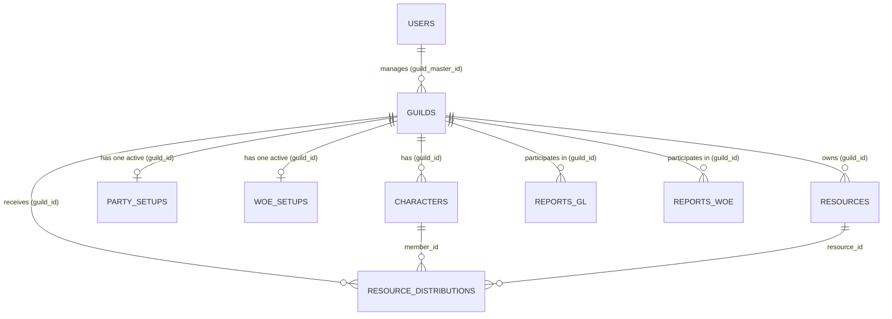

# Architecture

This document explains how ROOC PvP Ranker is put together: the stack, the data model, the
request/data flow, and the reasoning behind decisions. It is meant to be read by both humans and AI
assistants before making structural changes.

> For a machine-navigable map of the codebase, run `graphify query "<question>"`.

## 1. What this project is

ROOC PvP Ranker is a guild-management and PvP-ranking tool for a Ragnarok Online private server
("ROOC"). Guild masters register characters, fill in combat stats, and the app computes a weighted
**PvP score** per character and aggregates it per guild. It also tracks **War of Emperium (WoE)** and
**Guild League (GL)** attendance/results, resource (loot) distribution, and party (team) formation
for guild events.

## 2. Tech stack

| Layer             | Choice                                     | Notes                                                                                            |
| ----------------- | ------------------------------------------ | ------------------------------------------------------------------------------------------------ |
| Framework         | Next.js 16 (App Router, Turbopack)         | Standard Next.js without CMS wrappers; `output: 'standalone'` enabled for lightweight deployment |
| Backend & ORM     | Drizzle ORM + PostgreSQL (`postgres.js`)   | Pure type-safe SQL-like queries via `db.query` and `drizzle-orm/postgres-js`                     |
| Database          | PostgreSQL                                 | Self-hosted via Docker or managed PostgreSQL (Supabase / local container)                        |
| Authentication    | Native JWT (`jose`) + `bcryptjs`           | Secure httpOnly `payload-token` cookie session; no third-party auth server required              |
| File storage      | S3-compatible (Supabase Storage / MinIO)   | Custom integration in `src/utils/s3Upload.ts` using `@aws-sdk/client-s3`                         |
| UI                | React 19, Tailwind CSS 4                   | Server Components by default; `*Client.tsx` files are the interactive boundary                   |
| Charts            | Recharts                                   | Guild League / stats visualizations                                                              |
| Testing           | Vitest (integration), Playwright (e2e)     | Vitest database smoke tests and Playwright browser specs                                         |
| Deployment target | Docker / VPS (Oracle Cloud, Ubuntu Server) | Multi-stage Dockerfile producing a tiny, self-contained standalone server                        |

## 3. Directory map

```text
src/
├─ actions/          Server Actions ("use server"), grouped by feature:
│  ├─ auth/          login, logout, register, getAuthUser (session read)
│  ├─ dashboard/     guild CRUD + member verification
│  ├─ guild/         party generation/save, GL report saving
│  ├─ leaderboards/  public read-only rankings
│  ├─ resources/     loot/resource distribution workflow
│  ├─ stats/         character stat editing
│  └─ woe/           WoE setup + report saving
├─ app/
│  └─ (frontend)/    the public + guild-master facing app (route groups, no URL segment)
│     ├─ (dashboard)/  authenticated guild-master area (guild-league, member, resources, ...)
│     ├─ components/   shared UI (Button, Badge, Pagination, CharacterCard, ThemeProvider, ...)
│     ├─ login/, register/, leaderboards/, stats/
├─ const/            Shared enums/labels (job classes, stat labels)
├─ db/               Drizzle ORM schema & client singleton
│  ├─ index.ts       postgres.js connection pool & Drizzle client instance
│  └─ schema.ts      PostgreSQL tables, enums, and relations
├─ lib/              Application libraries (auth utilities)
│  └─ auth.ts        JWT cookie management (`jose`) & password hashing (`bcryptjs`)
└─ utils/            Pure helpers: calculatePvPScore, s3Upload, guildStats
```

## 4. Data model

Database schemas live in `src/db/schema.ts`.



- **Users** — accounts with roles `super_admin` or `guild_master`. Password hashed with bcrypt.
- **Guilds** — managed by a `guild_master`. Holds aggregated stats (`total_characters`, `total_pvp_score`, `gl_wins`, `gl_losses`, `gl_trends`).
- **Characters** — ~60 combat stat fields. `pvp_score` is calculated server-side upon saving via `src/utils/calculatePvPScore.ts`.
- **PartySetups** — party configurations (elite & sub-parties) stored as JSONB.
- **WoeSetups** — War of Emperium raid and party setups stored as JSONB.
- **ReportsGL** & **ReportsWoe** — event match reports and attendance logs.
- **Resources** & **ResourceDistributions** — item inventory and member distribution records with status (`pending`, `approved`, `claimed`).
- **Media** — metadata for S3 uploads.

## 5. Key subsystems

### 5.1 Auth

User sessions are handled via JWT signed with `jose` using `PAYLOAD_SECRET` (or `AUTH_SECRET`), stored in an `httpOnly` cookie named `payload-token`. `getAuthUser()` (`src/actions/auth/authUser.ts`) reads the cookie on the server and returns the verified user.

### 5.2 Server Actions as the API Layer

The application uses Next.js Server Actions (`src/actions/**`) directly from client components. Database operations are performed directly using Drizzle ORM (`db.query` or `db.insert/update/delete`).

### 5.3 Media / S3

`src/utils/s3Upload.ts` uploads files to S3-compatible object storage via `@aws-sdk/client-s3`. `next.config.ts` proxies `/api/media/file/:filename` to the storage endpoint.

### 5.4 PvP Scoring Engine

`src/utils/calculatePvPScore.ts` computes weighted power ratings per character job archetype. When a character's stats are updated, `updateGuildTotals()` in `src/utils/guildStats.ts` updates the guild's cumulative totals.
